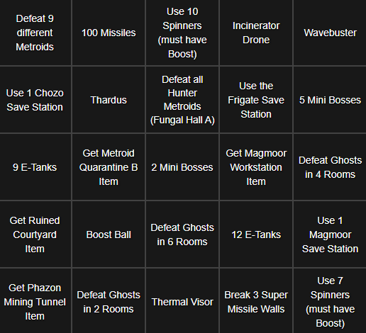

# Welcome

### Quick Links
- [Welcome](index.md)
- [Bingosync](https://www.bingosync.com/)
- [Presets](presets/presets.md)
- [Rules](rules.md)

Welcome to the wacky world of Metroid Prime Randomizer Bingo. Rather than marking squares announced from a caller, players instead race to fill squares on a not-so-traditional 5x5 bingo card where each square represent a specific tasks in the game.

# Getting Started

1) If you have not already, familiarize yourself with how to generate and play [Metroid Prime Randomizer seeds](https://randomizer.metroidprime.run/).

2) Read [The Rules](rules.md) and decide which mode you wish to play.

3) Generate a seed and distribute to the other players. Randomizer presets tailored specifically for Bingo can be found on the [Presets Page](presets/presets.md).

4) Create a room on [Bingosync](https://www.bingosync.com/) for *Metroid Prime* like so:

5) Have all participants join the room using the password set above.

6) Reveal the card and start the game when appropriate. Mark tiles on the board as they are completed. Have fun!

# Variants

### Randomizer Balanced

The normal board. Goals are weighted based on pre-determined difficulty levels and placed logically to make a balanced board. Great for races.

### Randomizer Chaos

Goals are unweighted and therefore placed entirely at random. More variety, but some very unbalanced boards are possible.

# Known Issues

*None yet. Let toasterparty or AeroRaiser know if you find any.*

# Contact

For questions or suggestions about Prime Randomizer/Bingo, seek help from the [Metroid Prime Randomizer Discord](https://discord.com/invite/WWGcay6).

The `metroid-prime-bingo` GitHub repository is maintained by `toasterparty#9244`.

The Bingosync Metroid Prime category is maintained by `AeroRaiser#7564`.
